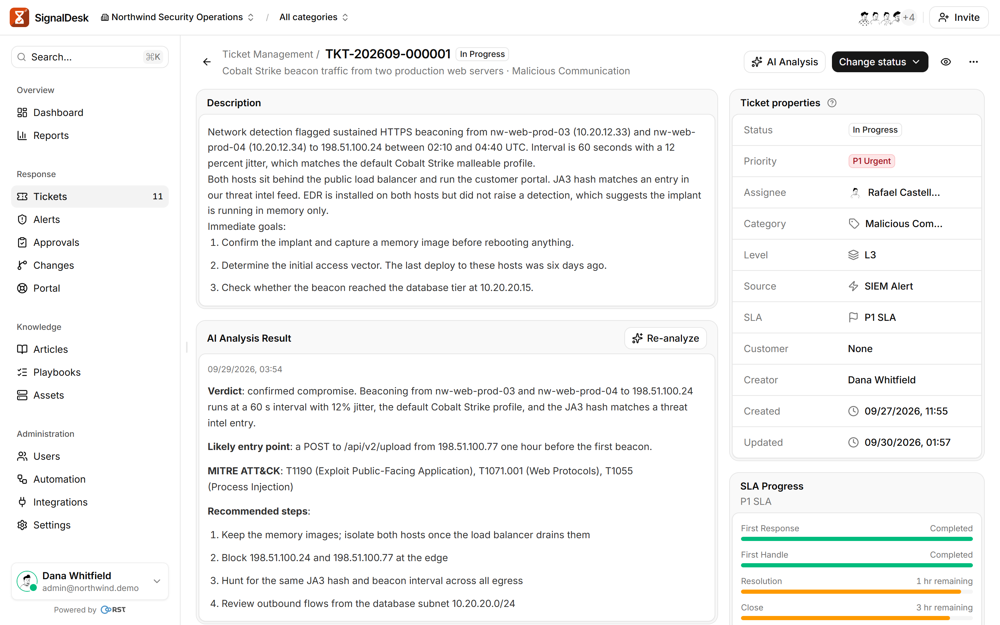
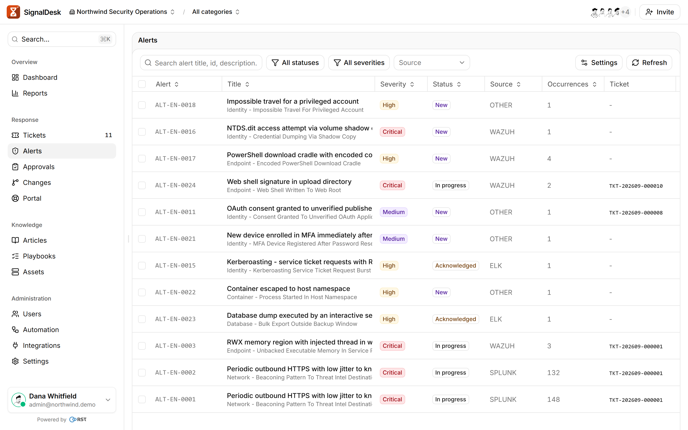
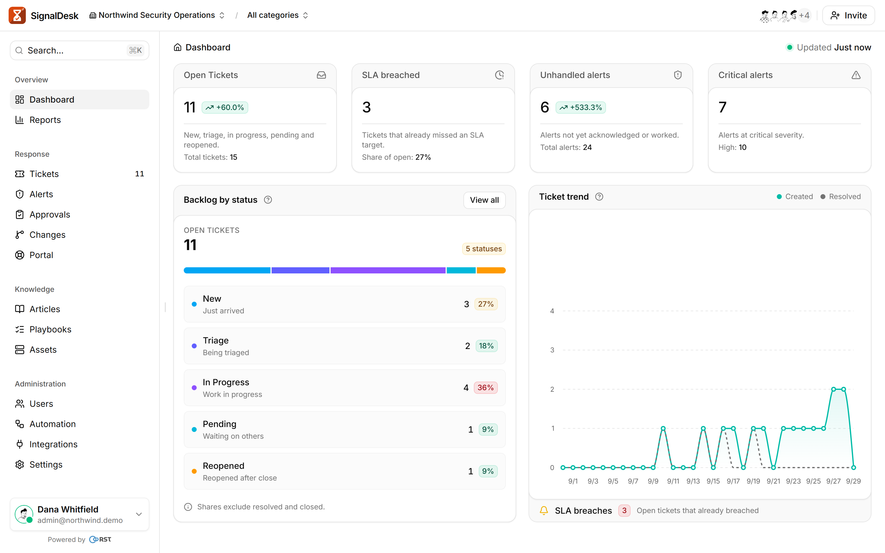
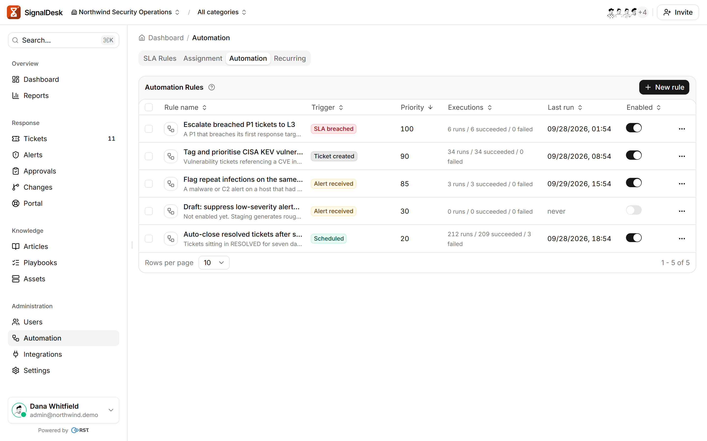
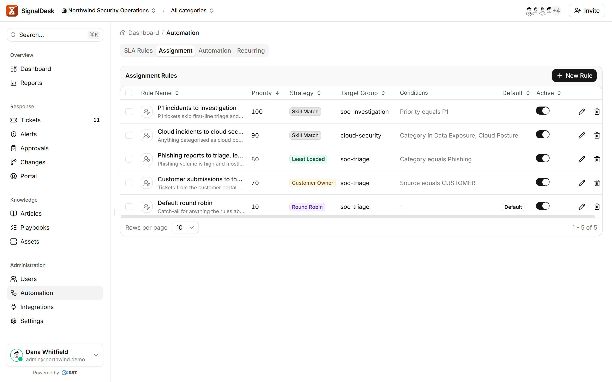
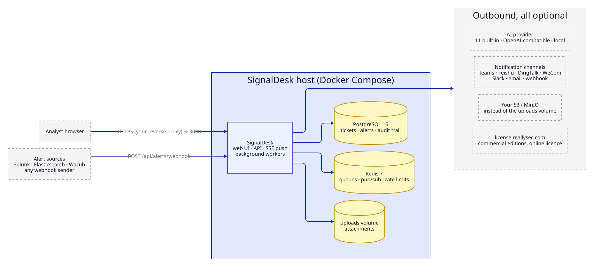

<p align="center">
  
</p>

<h1 align="center">SignalDesk</h1>

<p align="center">
  <b>Turn alerts into tickets your SOC can close.</b><br>
  A self-hosted ticketing workspace for security operations, fed by Splunk, Elasticsearch, Wazuh and generic webhooks:<br>
  SLA timers, playbooks, AI analysis and closing reports. Core security features are never paywalled, every AI call audited.
</p>

<p align="center">
  <a href="https://github.com/reallysec/signaldesk/releases"></a>
  <a href="LICENSE"></a>
  
  
  <a href="https://reallysec.com/en/docs/signaldesk"></a>
</p>

<p align="center">
  <b>English</b> · <a href="README.zh-CN.md">简体中文</a> · <a href="https://reallysec.com/en/docs/signaldesk">Docs</a> · <a href="https://github.com/reallysec/signaldesk/releases">Download</a> · <a href="https://github.com/reallysec/signaldesk/issues">Report an issue</a>
</p>

<p align="center">
  
</p>

## Why SignalDesk

- **Alerts arrive as tickets.** Point Splunk, Elasticsearch, Wazuh or any webhook at it. Duplicates are merged, related alerts are correlated to the same entity, and alert storms are suppressed before they flood the queue.
- **SLA clocks the team can trust.** Response and resolution targets per priority, business calendars, the clock paused while a ticket waits on someone else, warnings before a breach.
- **AI where it helps, on your terms.** On-demand analysis and closing reports on 11 built-in providers, any OpenAI-compatible endpoint or a local model. Every model call is audited.
- **Core security is never a paid feature.** Two-factor auth, password policy, CSRF protection, rate limiting and audit logging are all in the free Community Edition.

## Quick start

You need a Linux host with Docker Engine 24+ and Compose v2; 2 CPU cores, 4 GB of memory and 40 GB of disk are enough for a small team.

```bash
curl -fsSL https://github.com/reallysec/signaldesk/releases/latest/download/install.sh | sudo bash
```

The installer downloads the release bundle, verifies its checksum, installs to `/opt/signaldesk`, generates the secrets in `.env`, starts PostgreSQL, Redis and the app, and prints the first administrator's login. Open `http://<host>:3000` and sign in. Run it again later to upgrade; `.env` and `data/` are kept.

<details>
<summary><b>Air-gapped host</b></summary>

On a machine with internet access, download and verify the bundle without installing:

```bash
curl -fsSL https://github.com/reallysec/signaldesk/releases/latest/download/install.sh | bash -s -- --download-only
```

Copy `SignalDesk-<version>.tar.gz` to the target host, then:

```bash
tar xzf SignalDesk-<version>.tar.gz && cd SignalDesk-<version>
docker load -i SignalDesk-images-<version>.tar
cp .env.example .env        # DB_PASSWORD, REDIS_PASSWORD, JWT_SECRET (openssl rand -hex 32), SEED_*
docker compose up -d
```

</details>

<details>
<summary><b>Pull the image from GHCR instead</b></summary>

The same image is published as `ghcr.io/reallysec/signaldesk:<version>`. Take `docker-compose.yml` and `.env.example` from the bundle or from the [download repository](https://github.com/reallysec/signaldesk), fill in `.env`, then `docker compose pull && docker compose up -d`.

</details>

HTTPS, reverse proxy, upgrade, backup and every `.env` key: [documentation](https://reallysec.com/en/docs/signaldesk).

## Features

Everything below is in the free Community Edition: up to 5 staff users, no limit on tickets, alerts or customer portal users.

- **Ticket lifecycle**: 7-state workflow, bulk actions, comments, timeline, ticket linking, attachments (local disk or S3 / MinIO), templates, CSV export.
- **Alert ingestion**: Splunk, Elasticsearch, Wazuh and generic webhooks, with deduplication, entity correlation and storm suppression.
- **SLA and assignment**: SLA rules, breach detection and warnings, business calendars, manual, round-robin and least-loaded assignment.
- **AI**: on-demand analysis and AI-drafted closing reports on 11 built-in providers or any OpenAI-compatible endpoint, every call audited.
- **Collaboration**: notifications to Teams, Feishu, DingTalk, WeCom, Slack, email and webhooks, real-time in-app push, knowledge base, playbooks.
- **Access and audit**: 6 built-in roles, teams and user groups, TOTP two-factor auth, dashboards, asset CMDB, API keys, audit log.

<table>
  <tr>
    <td></td>
    <td></td>
  </tr>
</table>

## Commercial editions

Enterprise adds the automation layer: **multi-level escalation** (L1 → L2 → L3 with group targets), **skill-matched and customer-owner assignment**, an **automation rule engine** with 7 trigger types, **automatic AI triage** on ticket creation, **AI guardrails**, **scheduled reports** and unlimited audit retention, plus **SSO** (SAML, OIDC, OAuth2, LDAP), **SCIM** provisioning and **multi-tenancy** for MSSPs. Every edition runs the same image: to upgrade, import the licence in Settings › License, with no reinstall and data staying where it is (or set `RSTLIC_LICENSE_TOKEN` and restart).

<table>
  <tr>
    <td></td>
    <td></td>
  </tr>
</table>

<details>
<summary><b>Compare editions</b></summary>

| | Community | Enterprise |
|---|:---:|:---:|
| Everything under [Features](#features) | ✅ | ✅ |
| Staff users (customer portal users are free) | 5 | unlimited |
| **Multi-level escalation** (L1 → L2 → L3) with group targets | — | ✅ |
| **Skill-matched and customer-owner assignment** with load scoring | — | ✅ |
| **Automation rule engine** (7 trigger types) | — | ✅ |
| **Automatic AI triage** on ticket creation | — | ✅ |
| **AI guardrails**: output limits, sensitive-word masking, per-tenant quota | — | ✅ |
| **Scheduled reports** (CSV / JSON, email subscriptions), unlimited audit retention | — | ✅ |
| In-product update channel | ✅ | ✅ |
| SSO: SAML, OIDC, OAuth2, LDAP sync | — | ✅ |
| SCIM user provisioning | — | ✅ |
| Multi-tenant / MSSP: customer tenants, tenant switching, cross-tenant views | — | ✅ |
| Support | community | priority |

Assignment scoring and rule evaluation ship as encrypted modules; decryption keys are issued per host by the licence server. Details: [EDITIONS.md](EDITIONS.md). A 14-day trial unlocks every Enterprise feature: [console.reallysec.com](https://console.reallysec.com).

</details>

## Architecture and data boundary

<p align="center">
  
</p>

- Ingress: the analyst browser and the alert webhooks, both on one port (3000, or 443 behind your reverse proxy).
- Egress, all optional: the AI provider you configure, your notification channels, and `license.reallysec.com`: licence heartbeats for Enterprise Edition (not with an offline licence) and, for every edition, a daily check of the public release feed that sends only the product id and version (`SIGNALDESK_UPDATE_CHECK=0` turns it off).
- Tickets, alerts and audit trail stay in your PostgreSQL; attachments on local disk or your own S3 / MinIO.
- Every login, ticket change, AI call and settings change is an audit event.

## Supported versions

| Component | Supported |
|---|---|
| Alert sources | Splunk, Elasticsearch, Wazuh, any system that can send a webhook |
| AI provider | 11 built-in (OpenAI, Anthropic, Doubao, Qwen, DeepSeek, Zhipu, Moonshot and others), any OpenAI-compatible API, self-hosted models |
| Database | PostgreSQL 16, Redis 7 (both included in the compose file) |
| Host | Linux with Docker Engine 24+ and Docker Compose v2 |

## Community

- **Questions and bugs**: open an [issue](https://github.com/reallysec/signaldesk/issues). See [SUPPORT](https://github.com/reallysec/signaldesk/blob/main/SUPPORT.md) for where to ask what.
- **Security vulnerabilities**: do not open a public issue; follow the [security policy](https://github.com/reallysec/signaldesk/security/policy).
- **Feature requests**: welcome as issues. The source code is not public, so pull requests are not accepted.

## Licensing

SignalDesk is proprietary software and its source code is not published. Use is governed by the [SignalDesk EULA](LICENSE):

- **Community Edition**: free, no licence needed, up to 5 staff users on one node, including commercial use.
- **Enterprise**: activated online or with an offline licence. Trials and licences: [console.reallysec.com](https://console.reallysec.com).

"SignalDesk", "RST", "Reallysec", "斯普朗克" and the product logos are trademarks of Reallysec. Third-party components are listed in [THIRD-PARTY-NOTICES.md](THIRD-PARTY-NOTICES.md).

© Anhui Reallysec Information Technology Ltd.
