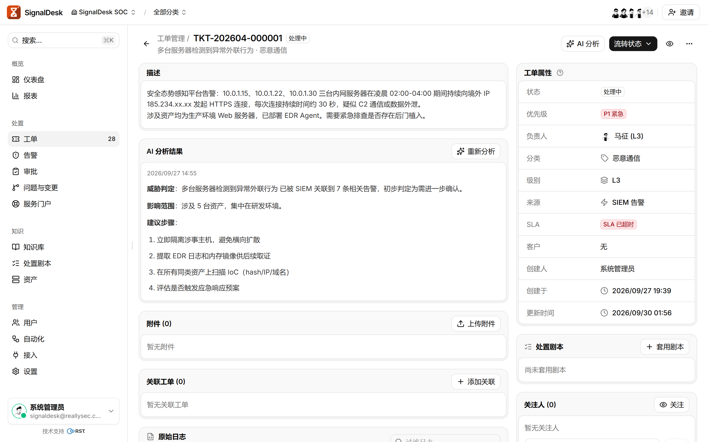
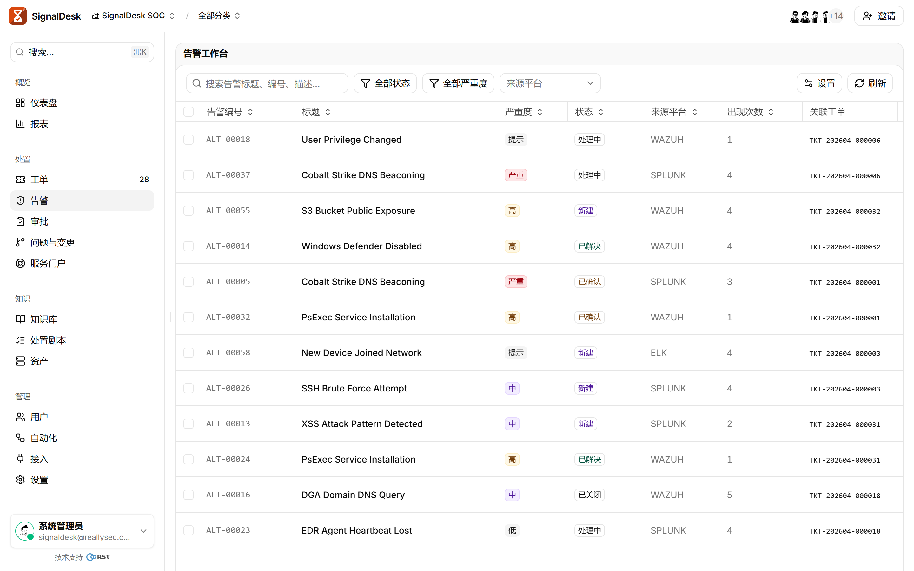
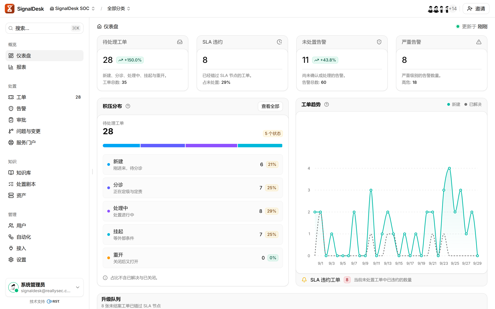
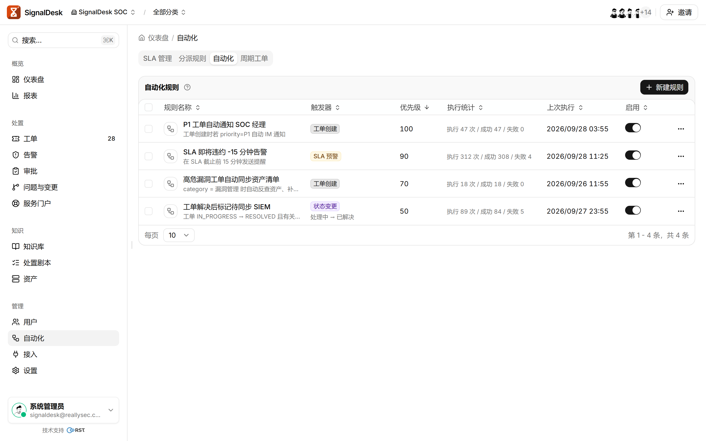
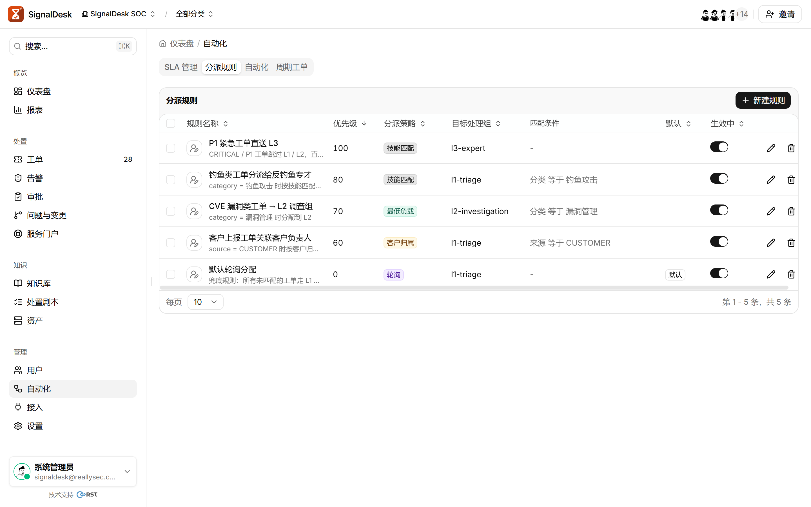
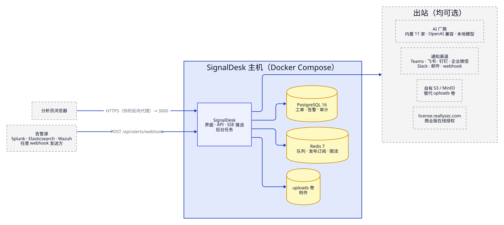

<p align="center">
  
</p>

<h1 align="center">SignalDesk</h1>

<p align="center">
  <b>把告警变成能结案的工单。</b><br>
  私有化部署的安全运营工单平台，接入 Splunk、Elasticsearch、Wazuh 与通用 webhook 告警：<br>
  SLA 计时、处置剧本、AI 分析与结案报告。安全能力从不收费，每一次 AI 调用都有审计。
</p>

<p align="center">
  <a href="https://github.com/reallysec/signaldesk/releases"></a>
  <a href="LICENSE"></a>
  
  
  <a href="https://reallysec.com/docs/signaldesk"></a>
</p>

<p align="center">
  <a href="README.md">English</a> · <b>简体中文</b> · <a href="https://reallysec.com/docs/signaldesk">文档</a> · <a href="https://github.com/reallysec/signaldesk/releases">下载</a> · <a href="https://github.com/reallysec/signaldesk/issues">报告问题</a>
</p>

<p align="center">
  
</p>

## 为什么选 SignalDesk

- **告警进来就是工单。** 把 Splunk、Elasticsearch、Wazuh 或任意 webhook 指过来即可。重复告警自动合并，同一实体的相关告警自动关联，告警风暴在淹没队列之前就被抑制。
- **团队信得过的 SLA 时钟。** 按优先级设响应与解决时限，支持工作日历；工单等待他方时暂停计时，违约前先预警。
- **AI 用在该用的地方，由你决定怎么用。** 按需分析与结案报告，可接 11 家内置厂商、任意 OpenAI 兼容端点或本地模型。每一次模型调用都有审计。
- **安全能力从不收费。** 双因素认证、密码策略、CSRF 防护、限流与审计日志全部包含在免费的社区版中。

## 快速开始

需要一台 Linux 主机（Docker Engine 24+、Compose v2）；小团队 2 核 CPU、4 GB 内存、40 GB 磁盘足够。

```bash
curl -fsSL https://github.com/reallysec/signaldesk/releases/latest/download/install.sh | sudo bash
```

安装脚本会下载交付包并校验、安装到 `/opt/signaldesk`、在 `.env` 里生成密钥、启动 PostgreSQL、Redis 和应用，最后打印第一个管理员的账号密码。打开 `http://<主机>:3000` 登录即可。以后再跑一遍就是升级，`.env` 和 `data/` 会保留。

<details>
<summary><b>离线主机</b></summary>

在能上网的机器上只下载并校验交付包，不安装：

```bash
curl -fsSL https://github.com/reallysec/signaldesk/releases/latest/download/install.sh | bash -s -- --download-only
```

把 `SignalDesk-<版本>.tar.gz` 拷到目标主机，然后：

```bash
tar xzf SignalDesk-<版本>.tar.gz && cd SignalDesk-<版本>
docker load -i SignalDesk-images-<版本>.tar
cp .env.example .env        # DB_PASSWORD、REDIS_PASSWORD、JWT_SECRET（openssl rand -hex 32）、SEED_*
docker compose up -d
```

</details>

<details>
<summary><b>改用 GHCR 镜像</b></summary>

同一个镜像也发布在 `ghcr.io/reallysec/signaldesk:<版本>`。从交付包或[下载仓库](https://github.com/reallysec/signaldesk)取 `docker-compose.yml` 和 `.env.example`，填好 `.env`，然后 `docker compose pull && docker compose up -d`。

</details>

HTTPS、反向代理、升级、备份与全部 `.env` 项：[文档](https://reallysec.com/docs/signaldesk)。

## 功能

以下能力全部包含在免费的社区版中：最多 5 个内部账号，工单数、告警数和服务门户客户账号都不设上限。

- **工单全生命周期**：7 种状态的流转、批量操作、评论、时间线、工单关联、附件（本地磁盘或 S3 / MinIO）、模板、CSV 导出。
- **告警接入**：Splunk、Elasticsearch、Wazuh 与通用 webhook，支持去重、实体关联与风暴抑制。
- **SLA 与分派**：SLA 规则、违约检测与预警、工作日历，手动、轮询与最低负载分派。
- **AI**：按需分析与 AI 起草的结案报告，可接 11 家内置厂商或任意 OpenAI 兼容端点，每次调用都有审计。
- **协作**：通知推送到 Teams、飞书、钉钉、企业微信、Slack、邮件与 webhook，站内实时推送，知识库，处置剧本。
- **权限与审计**：6 个内置角色、团队与用户组、TOTP 双因素认证、仪表盘、资产台账（CMDB）、API 密钥、审计日志。

<table>
  <tr>
    <td></td>
    <td></td>
  </tr>
</table>

## 商业版

企业版加上自动化这一层：**多级升级**（L1 → L2 → L3，可指定处理组）、**技能匹配与客户归属分派**、支持 7 种触发器的**自动化规则引擎**、建单时**自动 AI 分诊**、**AI 护栏**、**定时报表**，审计日志不限保留期，以及 **SSO**（SAML、OIDC、OAuth2、LDAP）、**SCIM** 用户同步和面向 MSSP 的**多租户**。所有版本用同一个镜像：升级只需填入许可证令牌并重启，数据原地保留。

<table>
  <tr>
    <td></td>
    <td></td>
  </tr>
</table>

<details>
<summary><b>版本对比</b></summary>

| | 社区版 | 企业版 |
|---|:---:|:---:|
| [功能](#功能)一节的全部内容 | ✅ | ✅ |
| 内部账号（服务门户客户账号免费） | 5 | 不限 |
| **多级升级**（L1 → L2 → L3），可指定处理组 | — | ✅ |
| **技能匹配与客户归属分派**，按负载打分 | — | ✅ |
| **自动化规则引擎**（7 种触发器） | — | ✅ |
| 建单时**自动 AI 分诊** | — | ✅ |
| **AI 护栏**：输出上限、敏感词脱敏、按租户配额 | — | ✅ |
| **定时报表**（CSV / JSON，邮件订阅），审计日志不限保留期 | — | ✅ |
| 产品内更新通道 | ✅ | ✅ |
| SSO：SAML、OIDC、OAuth2、LDAP 同步 | — | ✅ |
| SCIM 用户同步 | — | ✅ |
| 多租户 / MSSP：客户租户、租户切换、跨租户视图 | — | ✅ |
| 支持 | 社区 | 7×24 |

分派打分与规则求值以加密模块交付，解密钥匙由许可服务器按主机签发。详见 [EDITIONS.zh-CN.md](EDITIONS.zh-CN.md)。可申请 14 天试用，试用期内企业版全部功能可用：[console.reallysec.com](https://console.reallysec.com)。

</details>

## 架构与数据边界

<p align="center">
  
</p>

- 入站：分析员浏览器与告警 webhook，共用一个端口（3000，或反向代理后的 443）。
- 出站，全部可选：你配置的 AI 厂商、你的通知渠道，以及 `license.reallysec.com`：企业版的许可心跳（离线许可证不需要），以及各版本每天一次的发版源查询，只发产品标识和版本号（`SIGNALDESK_UPDATE_CHECK=0` 可关闭）。
- 工单、告警与审计记录留在你的 PostgreSQL 里；附件存本地磁盘或你自己的 S3 / MinIO。
- 每一次登录、工单变更、AI 调用和设置变更都是一条审计事件。

## 支持的版本

| 组件 | 支持 |
|---|---|
| 告警源 | Splunk、Elasticsearch、Wazuh，以及任何能发 webhook 的系统 |
| AI 厂商 | 内置 11 家（OpenAI、Anthropic、豆包、通义千问、DeepSeek、智谱、Moonshot 等），任意 OpenAI 兼容 API，自建模型 |
| 数据库 | PostgreSQL 16、Redis 7（compose 文件里都已包含） |
| 主机 | Linux，Docker Engine 24+ 与 Docker Compose v2 |

## 社区

- **问题与缺陷**：提 [issue](https://github.com/reallysec/signaldesk/issues)。什么问题去哪里问，见 [SUPPORT](https://github.com/reallysec/signaldesk/blob/main/SUPPORT.md)。
- **安全漏洞**：不要提公开 issue，请按[安全策略](https://github.com/reallysec/signaldesk/security/policy)报告。
- **功能需求**：欢迎以 issue 提出。源码不公开，不接受 pull request。

## 许可

SignalDesk 是专有软件，不公开源码，使用受[《SignalDesk 最终用户许可协议》](LICENSE)约束：

- **社区版**：免费，无需许可证，最多 5 个内部账号、1 个节点，可用于商业用途。
- **企业版**：在线激活或使用离线许可证。试用与购买：[console.reallysec.com](https://console.reallysec.com)。

「SignalDesk」「RST」「Reallysec」「斯普朗克」及产品标志是斯普朗克的商标。第三方组件见 [THIRD-PARTY-NOTICES.md](THIRD-PARTY-NOTICES.md)。

© 安徽斯普朗克信息技术有限公司（Anhui Reallysec Information Technology Ltd.）
